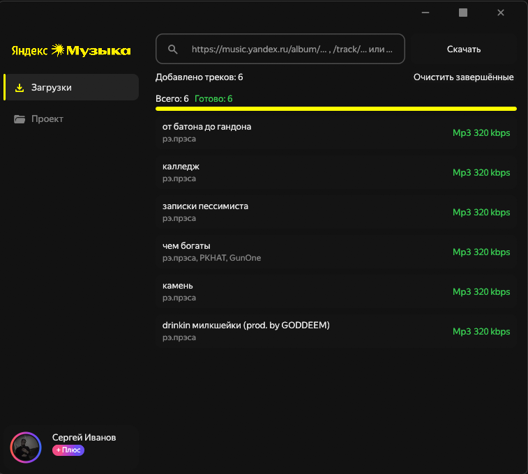
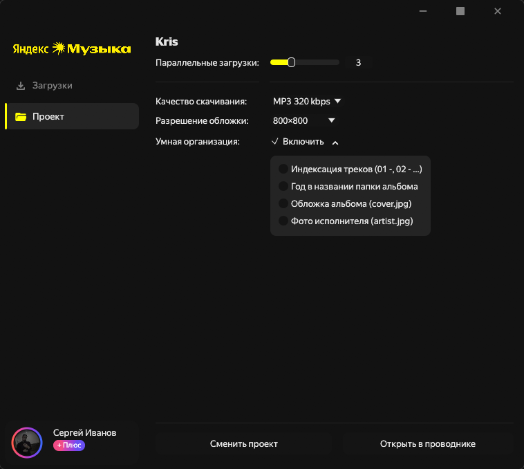

# Yandex Music Downloader

Десктопное приложение на Rust для сохранения музыки из Яндекс.Музыки в локальную медиатеку. Вставляешь ссылку на трек, альбом или плейлист — получаешь файлы в своей папке с полными тегами и обложкой.

## Интерфейс

<p>
  
  
</p>

## Возможности

- Загрузка треков, альбомов и плейлистов по ссылке
- Форматы: FLAC (lossless), M4A / AAC, MP3 (320 или 192 кбит/с)
- Встраивание тегов (исполнитель, альбом, год, жанр, номер трека, диска) и обложки
- Независимые библиотеки: можно вести отдельные коллекции в разных папках, каждая со своими настройками
- Умная организация медиатеки: `{Артист}/{Альбом}/Disc N/01 - Название.flac`
  - Опционально: добавлять год в название папки альбома → `Альбом (Год)`
  - Опционально: числовые префиксы треков `01 -`, `02 -`
  - Опционально: сохранять `cover.jpg` в папку альбома
  - Опционально: сохранять `artist.jpg` в папку исполнителя
- Параллельная загрузка нескольких треков
- Авторизация через браузер (Device Code Flow)

## Сборка

Требования: Rust 1.85+ (edition 2024).

На Windows для встраивания иконки нужен `rc.exe` или `llvm-rc` в PATH (входит в состав Windows SDK или LLVM).

```
cargo build --release
```

## Благодарности

- [yandex-music-api](https://github.com/MarshalX/yandex-music-api) — реверс-инжиниринг API Яндекс.Музыки, включая алгоритм подписи запроса `get-file-info`

## Правовая информация

Данное программное обеспечение разработано исключительно в образовательных и исследовательских целях и предназначено для личного использования.

Приложение функционирует только при наличии активной оплаченной подписки пользователя на сервис Яндекс.Музыка. Оно не обходит защиту от неоплаченного доступа (paywall).

Разработчик не несёт ответственности за любые прямые или косвенные последствия использования данного ПО. Вся ответственность за использование скачанных материалов лежит на конечном пользователе.

Категорически запрещается использовать данное приложение для пиратства, коммерческого распространения или нарушения авторских прав создателей музыкальных произведений. Сохранённые файлы предназначены исключительно для локального офлайн-прослушивания владельцем подписки.
